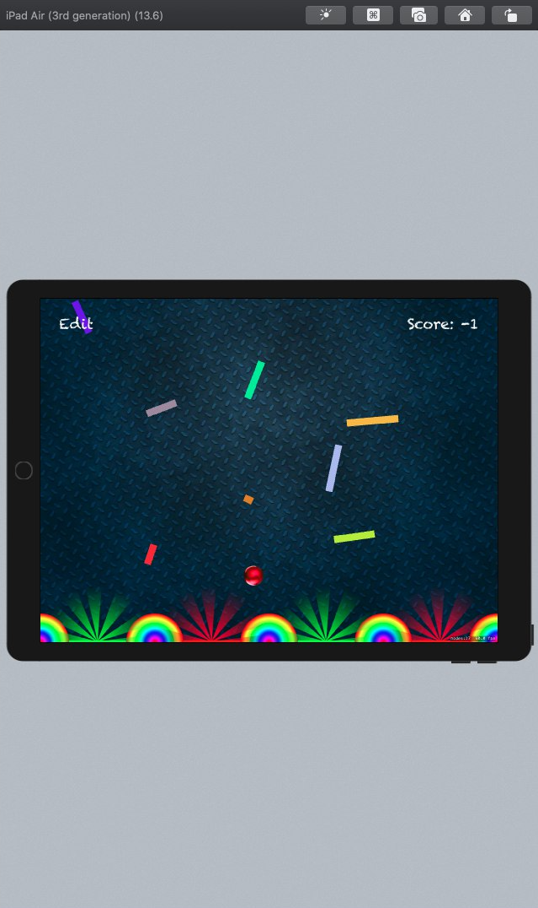

# iOS apps form the [100 days of Swift code course](https://www.hackingwithswift.com/100):

[File Manager](/FileManager)

[Guess the flag](/GuessTheFlag)

[Social Media](/SocialMedia)

[Easy Browser](/EasyBrowser)

[Word Scramble](/WordScramble)

[Auto Layout](/AutoLayout)

[WhiteHouse Petitions](/WhiteHousePetitions)

[Swifty Words](/SwiftyWords)

[Grand Central Dispatch](/GrandCentralDispatch)

[Names To Faces](/NamesToFaces)

[Pachinko](/Pachinko)

[User Defaults](/UserDefaults)

[Instafilter](/Instafilter)

[Whack a Penguin](/Penguin)
